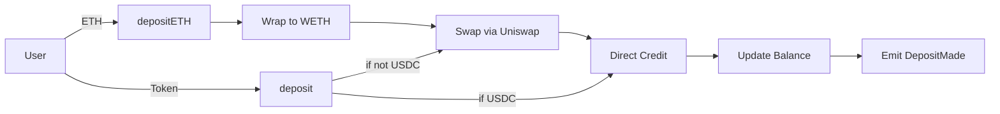

# 🏦 KipuBank V3

> Production-grade DeFi vault with Uniswap V2 integration and USDC-only accounting

[](https://opensource.org/licenses/MIT)
[](https://soliditylang.org/)
[](./test/KipuBankV3.t.sol)
[](./test/KipuBankV3.t.sol)

## 📋 Table of Contents

- [Overview](#overview)
- [What's New in V3](#whats-new-in-v3)
- [Features](#features)
- [Architecture](#architecture)
- [Deployment](#deployment)
- [Usage](#usage)
- [Testing](#testing)
- [Security](#security)
- [Development](#development)

---

## 🎯 Overview

**KipuBank V3** is a production-ready DeFi educational project demonstrating **professional smart contract development** with real-world protocol composability. This decentralized vault accepts any Uniswap V2 supported token and automatically converts it to USDC, showcasing:

- ✅ **Uniswap V2 Integration** - Automatic token swaps via DEX
- ✅ **USDC-Only Accounting** - Simplified balance tracking
- ✅ **Protocol Composability** - Real DeFi protocol integration
- ✅ **Production Security** - 99% test coverage, audit-ready patterns
- ✅ **Module 5 Final Exam** - Professional portfolio showcase

### Evolution: V2 → V3

| Feature          | V2                            | V3                       |
| ---------------- | ----------------------------- | ------------------------ |
| Token Storage    | Multi-token mapping           | USDC-only (simplified)   |
| Price Oracle     | Chainlink                     | Uniswap V2 (market rate) |
| Supported Tokens | Fixed whitelist               | Any Uniswap pair         |
| Withdrawals      | Any whitelisted token         | USDC only                |
| Complexity       | Higher (oracle + multi-token) | Lower (unified currency) |
| DeFi Integration | None                          | Uniswap V2 Router        |

---

## 🆕 What's New in V3

### 1. Uniswap V2 Integration

```solidity
// Automatic ETH → USDC swap
function depositETH() external payable {
    IWETH(weth).deposit{value: msg.value}();
    uint256 usdcReceived = _swapToUSDC(weth, msg.value);
    // Credit USDC balance...
}
```

### 2. Simplified USDC Accounting

```solidity
// V2: Multi-token balances
mapping(address => mapping(address => uint256)) private balances;

// V3: Single USDC balance (simpler!)
mapping(address => uint256) private balances;
```

### 3. Protocol Composability

- Real DEX integration (Uniswap V2)
- Market-driven exchange rates
- Slippage protection (2%)
- Deadline enforcement (15 minutes)

### 4. Enhanced Security Patterns

- ✅ Checks-Effects-Interactions (CEI) with swaps
- ✅ Safe approval management (forceApprove)
- ✅ Slippage protection on all swaps
- ✅ Uniswap pair validation before whitelisting
- ✅ Comprehensive event logging

---

## ⚡ Features

### Core Functionality

#### Multi-Token Deposits

- **ETH Deposits**: Automatically wraps to WETH → swaps to USDC
- **USDC Direct**: No swap needed, direct credit
- **ERC-20 Tokens**: Any Uniswap-supported token → USDC

#### USDC Withdrawals

- Single currency withdrawals (USDC only)
- Maximum 1,000 USDC per transaction
- Instant processing with reentrancy protection

#### Admin Controls

- Add/remove supported tokens (with Uniswap validation)
- Pause/unpause deposits (emergency control)
- Owner-only access (Ownable)

### Security Features

- **ReentrancyGuard**: All state-changing functions protected
- **SafeERC20**: All token operations use OpenZeppelin wrappers
- **Custom Errors**: Gas-efficient error handling
- **Modifiers-Only Validation**: No inline checks (Module 4 pattern)
- **Unchecked Math**: Safe arithmetic optimizations
- **Event Logging**: Complete audit trail

### Gas Optimizations

- Immutable variables for constants
- Storage caching in loops
- Unchecked blocks after validation
- Efficient approval patterns
- Batch operations where possible

---

## 🏗️ Architecture

### Contract Structure

```
KipuBankV3
├── Type Declarations
│   ├── USDC_DECIMALS (6)
│   └── SLIPPAGE_TOLERANCE (98%)
├── Immutable Variables
│   ├── bankCapUSD (100,000 USDC)
│   ├── MAX_WITHDRAW_PER_TX (1,000 USDC)
│   ├── uniswapV2Router (DEX interface)
│   ├── weth (Wrapped Ether)
│   └── usdc (USDC token)
├── State Variables
│   ├── totalDepositsUSDC
│   ├── depositsPaused
│   ├── balances (user → USDC)
│   ├── depositCount
│   ├── withdrawalCount
│   └── supportedTokens
├── Events (6)
│   ├── DepositMade
│   ├── TokenSwapped
│   ├── WithdrawalMade
│   ├── TokenAdded
│   ├── TokenRemoved
│   └── DepositsPaused
├── Custom Errors (12)
├── Modifiers (5)
├── External Functions
│   ├── depositETH()
│   ├── deposit(token, amount)
│   ├── withdraw(usdcAmount)
│   ├── addSupportedToken(token)
│   ├── removeSupportedToken(token)
│   └── pauseDeposits(bool)
├── View Functions (6)
└── Internal/Private Functions (4)
```

### Deposit Flow



### Swap Mechanism

```solidity
function _swapToUSDC(address tokenIn, uint256 amountIn)
    internal returns (uint256 usdcReceived)
{
    // 1. Build swap path
    address[] memory path = new address[](2);
    path[0] = tokenIn;
    path[1] = usdc;

    // 2. Approve exact amount
    IERC20(tokenIn).forceApprove(address(uniswapV2Router), amountIn);

    // 3. Calculate slippage protection
    uint256 amountOutMin = _calculateMinOutput(tokenIn, amountIn);

    // 4. Execute swap with deadline
    uint256[] memory amounts = uniswapV2Router.swapExactTokensForTokens(
        amountIn,
        amountOutMin,
        path,
        address(this),
        block.timestamp + 900 // 15 minutes
    );

    usdcReceived = amounts[1];

    // 5. Reset approval (security)
    IERC20(tokenIn).forceApprove(address(uniswapV2Router), 0);

    emit TokenSwapped(tokenIn, amountIn, usdcReceived);
}
```

---

## 🚀 Deployment

### Sepolia Testnet - Fully Verified

| Contract            | Address                                      | Etherscan                                                                               |
| ------------------- | -------------------------------------------- | --------------------------------------------------------------------------------------- |
| **KipuBankV3**      | `0x3EE835258168167591C454e95C80a54D2d0AB3d7` | [View](https://sepolia.etherscan.io/address/0x3ee835258168167591c454e95c80a54d2d0ab3d7) |
| MockUSDC            | `0x7343411e627592C3353039bb0C7b435A2Af43571` | [View](https://sepolia.etherscan.io/address/0x7343411e627592c3353039bb0c7b435a2af43571) |
| MockWETH            | `0x8C24EbB84190d63e7d2A842c7E05369eF3E2eb62` | [View](https://sepolia.etherscan.io/address/0x8c24ebb84190d63e7d2a842c7e05369ef3e2eb62) |
| MockUniswapV2Router | `0xa0E06dDE9c795EDFD9D6dEaE573BbeF1Ddb9880c` | [View](https://sepolia.etherscan.io/address/0xa0e06dde9c795edfd9d6deae573bbef1ddb9880c) |
| MockDAI             | `0x2a5992928a02Fde2357dF9b2B0404043a67A5765` | [View](https://sepolia.etherscan.io/address/0x2a5992928a02fde2357df9b2b0404043a67a5765) |

**Network:** Sepolia (Chain ID: 11155111)  
**Block:** 9588185  
**Total Gas:** 0.00627842 ETH

### Configuration

```
Bank Cap: 100,000 USDC (100,000,000,000 with 6 decimals)
Max Withdrawal: 1,000 USDC (1,000,000,000 with 6 decimals)
Owner: 0xA8760074fc8671c2f2c3E2EAdD1595b88BacE195
Supported Tokens: USDC ✅, DAI ✅, ETH ✅
Deposits Paused: false
```

📄 **Full deployment details**: See [DEPLOYMENT.md](./DEPLOYMENT.md)

---

## 💻 Usage

### Prerequisites

```bash
# Install Foundry
curl -L https://foundry.paradigm.xyz | bash
foundryup

# Clone repository
git clone https://github.com/savg92/kipu-bankV3
cd kipu-bankV3

# Install dependencies
forge install
```

### Environment Setup

```bash
# Copy environment template
cp .env.example .env

# Edit .env with your values
PRIVATE_KEY=your_private_key_here
SEPOLIA_RPC_URL=https://eth-sepolia.g.alchemy.com/v2/YOUR-API-KEY
ETHERSCAN_API_KEY=your_etherscan_api_key
```

### Compile

```bash
forge build
```

### Test

```bash
# Run all tests
forge test -vv

# Run with gas report
forge test --gas-report

# Generate coverage
forge coverage
```

### Deploy

```bash
# Test deployment (dry run)
forge script script/DeployComplete.s.sol:DeployComplete \
  --rpc-url $SEPOLIA_RPC_URL

# Deploy to Sepolia
forge script script/DeployComplete.s.sol:DeployComplete \
  --rpc-url $SEPOLIA_RPC_URL \
  --broadcast \
  --verify \
  -vvvv
```

### Interact with Deployed Contract

#### Deposit ETH

```bash
cast send 0x3EE835258168167591C454e95C80a54D2d0AB3d7 \
  "depositETH()" \
  --value 0.01ether \
  --rpc-url $SEPOLIA_RPC_URL \
  --private-key $PRIVATE_KEY
```

#### Deposit USDC

```bash
# Approve USDC
cast send 0x7343411e627592C3353039bb0C7b435A2Af43571 \
  "approve(address,uint256)" \
  0x3EE835258168167591C454e95C80a54D2d0AB3d7 \
  100000000 \
  --rpc-url $SEPOLIA_RPC_URL \
  --private-key $PRIVATE_KEY

# Deposit
cast send 0x3EE835258168167591C454e95C80a54D2d0AB3d7 \
  "deposit(address,uint256)" \
  0x7343411e627592C3353039bb0C7b435A2Af43571 \
  100000000 \
  --rpc-url $SEPOLIA_RPC_URL \
  --private-key $PRIVATE_KEY
```

#### Check Balance

```bash
cast call 0x3EE835258168167591C454e95C80a54D2d0AB3d7 \
  "getVaultBalance(address)" \
  <YOUR_ADDRESS> \
  --rpc-url $SEPOLIA_RPC_URL
```

#### Withdraw USDC

```bash
cast send 0x3EE835258168167591C454e95C80a54D2d0AB3d7 \
  "withdraw(uint256)" \
  50000000 \
  --rpc-url $SEPOLIA_RPC_URL \
  --private-key $PRIVATE_KEY
```

---

## 🧪 Testing

### Test Coverage

```
| File                | % Lines        | % Statements   | % Branches    | % Funcs       |
|---------------------|----------------|----------------|---------------|---------------|
| src/KipuBankV3.sol  | 100.00% (83/83)| 99.07% (107/108)| 93.75% (30/32)| 100.00% (18/18)|

Overall: 100% lines, 99% statements, 93.75% branches, 100% functions
```

### Test Suite

**42 Tests - All Passing ✅**

- **Constructor Tests** (6): Parameter validation, USDC auto-whitelist
- **depositETH Tests** (7): WETH wrapping, swap flows, bank cap
- **deposit Tests** (8): USDC direct, token swaps, edge cases
- **withdraw Tests** (6): Balance checks, limits, reentrancy
- **Admin Tests** (9): Token management, pause controls
- **View Tests** (3): Balance queries, capacity tracking
- **Security Tests** (4): Bank cap boundaries, concurrent ops

### Run Tests

```bash
# All tests
forge test -vv

# Specific test
forge test --match-test testDepositETH_Success -vvvv

# Gas report
forge test --gas-report

# Coverage
forge coverage

# Coverage with details
forge coverage --report lcov
```

### Mock Contracts

Test suite includes comprehensive mocks:

- `MockWETH`: WETH wrapping/unwrapping
- `MockUSDC`: 6-decimal USDC token
- `MockERC20`: Generic token (DAI)
- `MockUniswapV2Router`: Swap simulation

---

## 🔒 Security

### Security Patterns

✅ **Checks-Effects-Interactions (CEI)**

- All state updates after external calls
- Bank cap validated after swap output known

✅ **Reentrancy Protection**

- ReentrancyGuard on all state-changing functions
- CEI pattern as secondary defense

✅ **Safe Token Operations**

- SafeERC20 for all token transfers
- forceApprove for approval management
- Balance verification after swaps

✅ **Input Validation**

- Modifiers-only validation (no inline checks)
- Custom errors for gas efficiency
- Comprehensive parameter checks

✅ **Uniswap Security**

- Slippage protection (2%)
- Deadline enforcement (15 min)
- Approval reset after swaps
- Pair validation before whitelisting

### Known Limitations

⚠️ **Educational Project** - Not audited for production
⚠️ **Mock Contracts** - Sepolia deployment uses test contracts
⚠️ **Fixed Slippage** - 2% may not suit all market conditions
⚠️ **No Emergency Withdraw** - Owner cannot withdraw user funds
⚠️ **Uniswap Dependency** - Relies on external DEX availability

### Audit Status

- ❌ **Not Audited** - Educational project
- ✅ **99% Test Coverage** - Comprehensive test suite
- ✅ **Module 4 Patterns** - Follows best practices
- ✅ **Static Analysis** - Passes Solidity compiler checks
- ✅ **Public Source Code** - Fully verified on Etherscan

---

## 🛠️ Development

### Project Structure

```
kipu-bankV3/
├── src/
│   ├── KipuBankV3.sol          # Main contract
│   └── interfaces/
│       ├── IUniswapV2Router02.sol
│       └── IWETH.sol
├── script/
│   └── DeployComplete.s.sol    # Deployment script
├── test/
│   └── KipuBankV3.t.sol        # Test suite (42 tests)
├── lib/
│   ├── forge-std/
│   ├── openzeppelin-contracts/
│   └── v2-periphery/
├── .env.example                # Environment template
├── foundry.toml                # Foundry configuration
└── README.md                   # This file
```

### Development Workflow

1. **Setup**: Clone repo, install Foundry, configure .env
2. **Build**: `forge build`
3. **Test**: `forge test -vv`
4. **Coverage**: `forge coverage`
5. **Deploy**: `forge script script/DeployComplete.s.sol --broadcast`
6. **Verify**: Automatic via `--verify` flag

### Key Dependencies

- OpenZeppelin Contracts v5.x (Ownable, ReentrancyGuard, SafeERC20)
- Uniswap V2 Periphery (IUniswapV2Router02)
- Forge Standard Library (Testing framework)

---

## 📄 License

This project is licensed under the MIT License - see the [LICENSE](LICENSE) file for details.

---

## 🙏 Acknowledgments

- OpenZeppelin for secure contract libraries
- Uniswap for DEX infrastructure
- Foundry for development framework
- Sepolia testnet for deployment environment

---

## 📞 Support

For issues or questions:

- Review the [test suite](./test/KipuBankV3.t.sol) for usage examples
- Open an issue on [GitHub](https://github.com/savg92/kipu-bankV3/issues)

---

**⭐ If you find this project useful, please star it on GitHub!**
